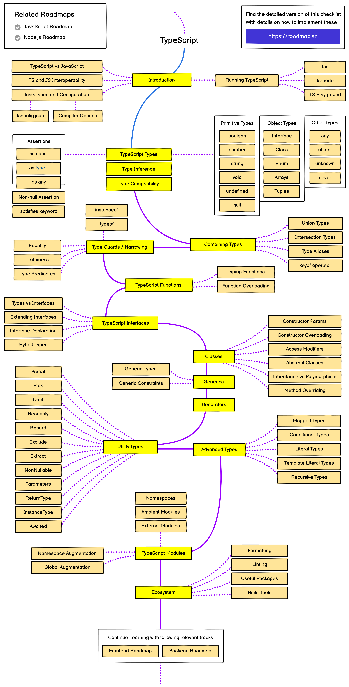

# Javascript & Typescript

## Overview

This section covers both JavaScript and TypeScript programming languages, essential for modern web development. JavaScript is a versatile scripting language used for creating interactive web applications, while TypeScript adds static typing to enhance code quality and maintainability.

## Key Features

- **JavaScript**: Dynamic typing, first-class functions, prototype-based object-orientation
- **TypeScript**: Static typing, interfaces, generics, and advanced type checking
- **ES6+ Features**: Arrow functions, destructuring, promises, async/await, modules
- **DOM Manipulation**: Event handling, element selection, and dynamic content updates
- **Frameworks Integration**: Compatibility with React, Vue, Angular, and Node.js

## PDF Documents

### Typescript

## Learning Path

1. JavaScript Fundamentals
2. ES6+ Features
3. TypeScript Basics
4. Advanced TypeScript Concepts
5. JavaScript Frameworks
6. Testing & Debugging

## Projects

This folder contains multiple example projects and exercises demonstrating JavaScript and TypeScript concepts, from simple scripts to complex applications.
