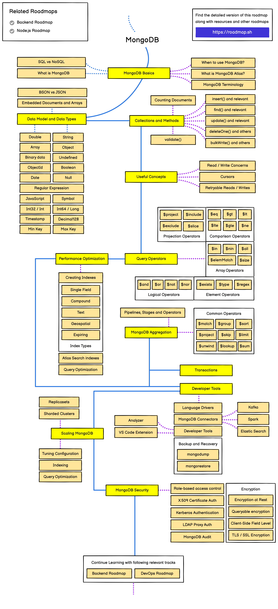

# MongoDB

## Overview

MongoDB is a popular NoSQL database that provides high performance, high availability, and easy scalability. It works on the concept of collections and documents, offering a flexible schema approach that makes integrating data in certain types of applications easier and faster.

## Key Features

- **Document-Oriented**: Stores data in JSON-like documents with dynamic schemas
- **Distributed Database**: Built-in sharding for horizontal scaling
- **High Availability**: Replica sets for automatic failover and data redundancy
- **Indexing**: Support for various types of indexes for query optimization
- **Aggregation Framework**: Powerful data processing pipeline for analytics

## PDF Documents

### MongoDB Documentation

## MongoDB and Node.js

This section includes examples of how to integrate MongoDB with Node.js applications using:

- MongoDB Native Driver
- Mongoose ODM (Object Document Mapper)
- CRUD operations examples
- Authentication and authorization implementations

## Common Use Cases

- Content management systems
- E-commerce platforms
- Real-time analytics
- Mobile applications
- IoT data storage
- Caching and high-performance applications
