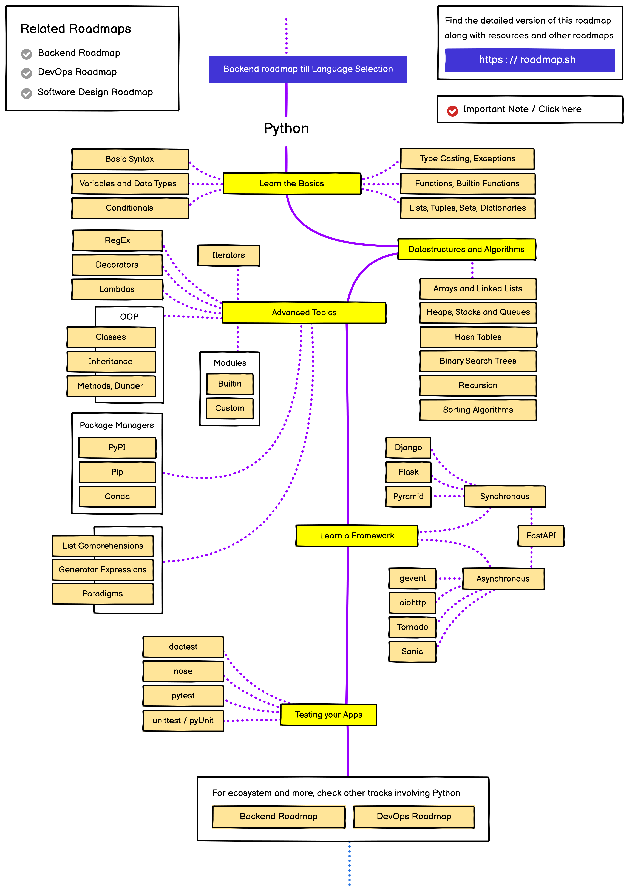

# Python

## Overview

Python is a high-level, interpreted programming language known for its simplicity and readability. It has become one of the most popular languages for various applications including web development, data science, artificial intelligence, and automation.

## Key Features

- **Easy to Learn**: Simple, readable syntax that emphasizes code readability
- **Versatile**: Used in web development, data science, AI, automation, and more
- **Extensive Libraries**: Rich ecosystem of packages for various applications
- **Cross-Platform**: Runs on Windows, macOS, Linux, and other platforms
- **Interpreter-Based**: No compilation needed, making development faster

## PDF Documents

### Python Documentation

## Learning Path

1. Python Basics (variables, data types, control flow)
2. Functions and Object-Oriented Programming
3. Files and Exception Handling
4. Libraries and Modules
5. Data Manipulation with NumPy and Pandas
6. Web Development with Flask or Django
7. Data Visualization and Analysis

## Applications

- Web and API development
- Data analysis and visualization
- Machine learning and AI
- Automation and scripting
- Scientific computing
- Game development
