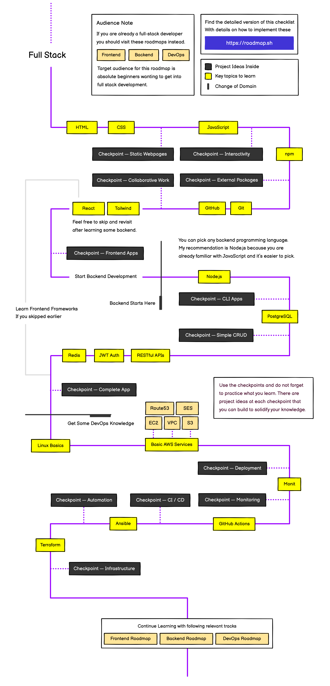

# Fullstack Bootcamp 2025 🚀

<div align="center">
  


[](https://github.com/naimkatiman/FullstackBootcamp2025/stargazers)
[](https://github.com/naimkatiman/FullstackBootcamp2025/network)
[](https://github.com/naimkatiman/FullstackBootcamp2025/issues)
[](https://github.com/naimkatiman/FullstackBootcamp2025)
[](https://github.com/naimkatiman/FullstackBootcamp2025/commits/main)

</div>

<div align="center">
  
</div>

## 🔥 2025 Update

This repository has been recently updated with new curriculum content for 2025, including:
- **Latest frameworks and libraries**
- **New PDF documents and study materials**
- **Updated course notes and examples**
- **Enhanced project structures and templates**

<div align="center">
  
  
  
</div>

## 📚 About This Repository

Welcome to my Fullstack Bootcamp 2025 repository. This repository contains all the projects and exercises I worked on during the boot camp, showcasing a wide range of skills and technologies I explored and experimented with.

<div align="center">
  
</div>

## 🛠️ Skills and Technologies

<div align="center">
  <table>
    <tr>
      <td align="center">
        
        <br>HTML
      </td>
      <td align="center">
        
        <br>CSS
      </td>
      <td align="center">
        
        <br>JavaScript
      </td>
      <td align="center">
        
        <br>React
      </td>
      <td align="center">
        
        <br>Vue
      </td>
    </tr>
    <tr>
      <td align="center">
        
        <br>Node.js
      </td>
      <td align="center">
        
        <br>PHP
      </td>
      <td align="center">
        
        <br>Python
      </td>
      <td align="center">
        
        <br>Docker
      </td>
      <td align="center">
        
        <br>MongoDB
      </td>
    </tr>
  </table>
</div>

### Web Development
- **Languages**: HTML, CSS, JavaScript
- **Libraries and Frameworks**: jQuery, Bootstrap, Vue, React, PHP, Laravel, Flask, Django, WordPress

### Databases and Backend
- **Databases**: MySQL, MongoDB, Firebase, Redis
- **Backend**: Node.js

### DevOps and Tools
- **Operating Systems**: Linux
- **Version Control**: Git, GitHub
- **Project Management**: Jira, Confluence
- **Containerization and Orchestration**: Docker
- **Messaging**: Apache Kafka

### Cloud Computing
- **Cloud Platforms**: Various cloud platforms and services

### Machine Learning and Data Science
- **Languages**: Python
- **Libraries**: Pandas, Numpy, Matplotlib, TensorFlow, Keras, Scikit-learn

### APIs and Frameworks
- **APIs**: RESTful APIs

### Agile Methodologies and Digital Leadership
- **Methodologies**: Agile practices and digital leadership principles

## 📂 Projects

<div align="center">
  
</div>

Here is a list of some of the projects included in this repository:

### Web Development Projects
- **Project 1**: Basic HTML and CSS Website
- **Project 2**: JavaScript Interactive Website
- **Project 3**: Vue and React Applications

### Backend and Database Projects
- **Project 4**: Node.js and Express API
- **Project 5**: MongoDB and MySQL Integration

### DevOps Projects
- **Project 6**: Dockerized Applications
- **Project 7**: CI/CD Pipeline with GitHub Actions

### Machine Learning Projects
- **Project 8**: Data Analysis with Pandas
- **Project 9**: Machine Learning Models with Scikit-learn and TensorFlow

## 🚀 Getting Started

To get started with any of the projects, clone the repository and follow the instructions provided in each project's folder.

```bash
git clone https://github.com/naimkatiman/FullstackBootcamp2025.git
cd FullstackBootcamp2025
```

Each project folder contains a README with detailed instructions on how to set up and run the project.

## 📚 PDF Documents

<div align="center">
  
</div>

In this repository, you'll find important PDF documents in their respective technology folders. Each folder contains a README.md file that displays the PDF contents for easy viewing. The main PDFs include:

### Full Stack Development-Digital Notes


### Full-Stack Development Overview


## 📊 Repository Structure

```
FullstackBootcamp2025/
├── AWS/
│   ├── images/
│   └── README.md
├── Docker/
│   ├── images/
│   └── README.md
├── Javascript & Typescript/
│   ├── images/
│   └── README.md
├── Linux Tutorial/
│   ├── images/
│   └── README.md
├── MongoDB/
│   ├── images/
│   └── README.md
├── PHP/
│   ├── images/
│   └── README.md
├── Python/
│   ├── images/
│   └── README.md
├── React/
│   ├── images/
│   └── README.md
├── Redis/
│   ├── images/
│   └── README.md
└── README.md
```

## 📫 Contact

If you have any questions about this repository, feel free to reach out or open an issue!

<div align="center">
  
  
  
  
</div>

---

<div align="center">
  <p>⭐ Don't forget to star this repository if you find it useful! ⭐</p>
  <p>© 2025 Fullstack Bootcamp. All rights reserved.</p>
</div>

