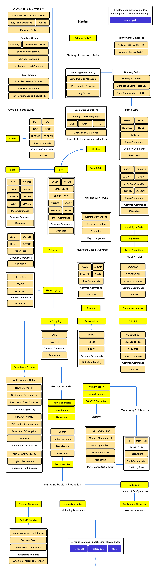

# Redis

## Overview

Redis (Remote Dictionary Server) is an open-source, in-memory data structure store that can be used as a database, cache, message broker, and streaming engine. It's known for its exceptional performance, versatility, and support for various data structures.

## Key Features

- **In-Memory Storage**: Extremely fast data access
- **Data Structures**: Supports strings, hashes, lists, sets, sorted sets, streams, and more
- **Persistence Options**: RDB snapshots and AOF logs for durability
- **High Availability**: Replication and Redis Sentinel for automatic failover
- **Scaling**: Cluster mode for horizontal scaling
- **Pub/Sub**: Built-in publish/subscribe messaging paradigm

## PDF Documents

### Redis Documentation

## Use Cases

- **Caching**: Reduce database load and improve application performance
- **Session Management**: Handle user sessions in web applications
- **Real-time Analytics**: Count metrics and track events
- **Leaderboards**: Maintain sorted sets for rankings
- **Rate Limiting**: Control API usage and prevent abuse
- **Message Queues**: Reliable asynchronous communication between services

## Integration Examples

The examples in this directory demonstrate how to integrate Redis with various programming languages and frameworks, focusing on common patterns and best practices.
